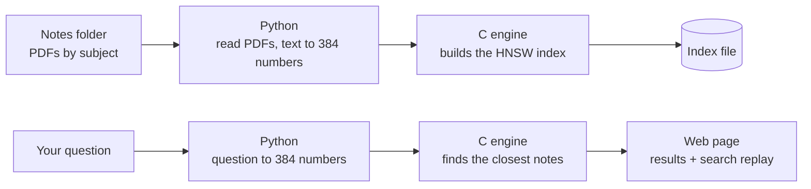

# Semantic Search for Study Notes

**Search your own study notes by meaning, not exact words**, powered by an HNSW graph
index written from scratch in C.

> Data Structures and Applications (CS233AI) · Experiential Learning project ·
> RV College of Engineering, Bengaluru

---

## The problem

Students keep notes as dozens of PDFs, slides and scanned pages across every subject.
When they need something, they remember the *idea*, not the exact words or the file it is in.
But every search on a laptop, from folder search to Ctrl+F, only matches exact words.

**Example:** searching *"back button"* gives 0 results, even though the answer is on
page 7 of `Unit2_Stacks.pdf`, written as *"browser history is stored in a stack"*.
Same idea, different words, so keyword search misses it.

## The idea

1. **Notes become points.** A small, pre-trained embedding model turns each chunk of notes
   into a list of 384 numbers. Chunks with similar meaning get nearby points.
2. **The question becomes a point**, converted the same way.
3. **The closest points are the answer.** Finding them quickly, without comparing the
   question against every note, is the data-structure problem this project solves in C.

The result: type a question in plain English, and get back the exact PDF and page that
answers it, even when none of your words appear on that page.

## How it works



| Part | Language | Responsibility |
| --- | --- | --- |
| Engine | C | **Every data structure and the search itself** |
| Pipeline | Python | Extract PDF text, split into chunks, run the embedding model |
| Server | Python | Start the engine, pass questions to it |
| Web page | HTML / JS | Show results, open the PDF at the right page, visualise the search |

Python and JavaScript only convert, send and draw. They never search, sort or store the
index. Everything runs **offline on the laptop**; notes never leave the machine.

## Data structures (all in C, from scratch)

| Data structure | Its job |
| --- | --- |
| **Layered graph (HNSW index)**, adjacency lists per layer | Links each note to its most similar notes; upper layers hold fewer notes for long jumps |
| **Min-heap** (priority queue) | Candidate list: always explore the closest unchecked note next |
| **Max-heap** (priority queue) | Keeps the best *k* results; the worst sits on top and is dropped in O(log k) |
| **Dynamic arrays** | Vectors and note records (file, page, snippet), indexed by note ID |
| **Visited array** | No note is compared twice in one search |
| **Brute-force scan** | Exact baseline used to check correctness and measure speed-up |

### What is HNSW?

**Hierarchical Navigable Small World** is a graph-based search index. Every note is linked
to its most similar notes, and the links are stacked in layers: a few long-distance links
at the top, every note at the bottom. A search starts at the top layer, moves towards the
question, and drops down a layer whenever it can't get any closer, like taking a metro,
then a bus, then walking the last bit.

Distance is **squared Euclidean distance** (the square root is skipped because it never
changes which note is closest). Note vectors are unit length, so the ranking matches
cosine similarity.

## How we evaluate it

- **Speed comparison:** query time and number of notes compared, HNSW vs brute force.
- **Accuracy check:** recall@10, the share of the true 10 closest notes that HNSW also returns.
- **Scale test:** both methods on a 100,000-vector subset of the public SIFT benchmark.

## Project status

- [x] Project setup, toolchain checks and engine protocol
- [ ] Vector store, distance, brute force and heaps *(design done)*
- [ ] HNSW insert and search
- [ ] Engine program: commands, save and load
- [ ] Python pipeline: PDFs to vectors
- [ ] Server and search page
- [ ] Visuals: search replay, comparison panel, notes map
- [ ] Evaluation and report

## Repository layout

```
engine/      C engine: every data structure (include/, src/, tests/, Makefile)
pipeline/    Python: PDF reading, chunking, embeddings
server/      Python: runs the engine, serves the page
web/         Search page and visuals
bench/       Evaluation scripts and results
data/        Notes and saved index (kept out of git)
docs/        protocol.md (engine contract), design.md (design notes)
```

## Getting started

**Requirements:** gcc (MinGW-w64 on Windows, or any gcc on Linux), make, Python 3.10+.

```
# C toolchain check
cd engine
make check            # Windows/MinGW: mingw32-make check

# Python packages
cd ..
pip install -r requirements.txt
python pipeline/check_setup.py
```

## Documentation

- [`docs/protocol.md`](docs/protocol.md): how the server talks to the engine, and the file formats
- [`docs/design.md`](docs/design.md): design notes for each build step

## Tech stack

C99 · Python 3 (PyMuPDF, sentence-transformers with all-MiniLM-L6-v2, Flask) · HTML/CSS/JavaScript

## References

1. Malkov, Y. A., & Yashunin, D. A. (2020). Efficient and robust approximate nearest neighbor
   search using hierarchical navigable small world graphs. *IEEE TPAMI, 42*(4), 824–836.
2. Reimers, N., & Gurevych, I. (2019). Sentence-BERT: Sentence embeddings using Siamese
   BERT-networks. *EMNLP-IJCNLP 2019*, 3982–3992.
3. Jégou, H., Douze, M., & Schmid, C. (2011). Product quantization for nearest neighbor
   search. *IEEE TPAMI, 33*(1), 117–128.
